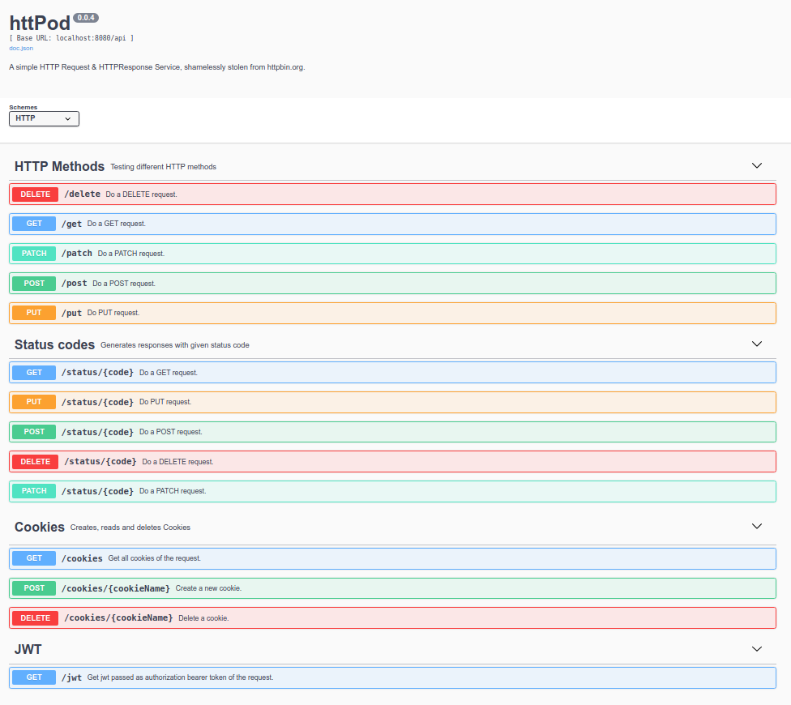

# httpod


A simple HTTP Request & Response Service written in go, shamelessly stolen from [httpbin](https://httpbin.org).



### Additional features
Like the famous `httpbin` this service provides several API's for testing HTTP requests and a 
corresponding swagger GUI. It adds some features helpful for testing in kubernetes or istio environments:
* With environment variable `BASE_PATH`, a "*context root*" can be configured. This is helpful if routing is done via path prefix.
* The service handles `X-Forwarded-Host` and `X-Forwarded-Prefix` headers. This is helpful, if ingress controller or virtual services rewrite the destination path.

### Currently implemented API's:
* **HTTP Methods**: Testing DELETE, GET, PATCH, POST and  PUT requests. TODO: add url parameters
* **Status codes**: Generates responses with given status code
* **Cookies**: Creates, reads and deletes cookies

## Devel

```shell
# Download swag once:
go get -u github.com/swaggo/swag/cmd/swag
# Create swagger info
swag init -g cmd/main.go -o internal/docs 

# Run
go run cmd/main.go

# Open browser on http://localhost:8080/swagger/index.html
```

## Run docker image

```shell
docker pull ghcr.io/tgunsch/httpod:latest

# Access http://localhost:8080/swagger/index.html
docker run --rm -p 8080:8080  ghcr.io/tgunsch/httpod:latest

# Access http://localhost:8080/httpod/swagger/index.html
docker run --rm -p 8080:8080  -e BASE_PATH=httpod ghcr.io/tgunsch/httpod:latest
```
